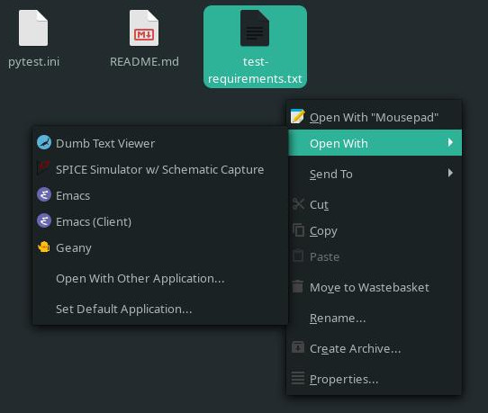

===============
Packaging a GUI
===============

In this tutorial, we'll be packaging an example user interface application. The
application itself is fairly simple packaging-wise so it won't take us long to
get a build that passes. The interesting part will be adding desktop
integration, creating a desktop launcher for the ``dumb_text_viewer``
``gui-script`` defined in its ``pyproject.toml``, for which we'll need to
generate and install a ``.desktop`` file.

Setup
.....

First, go get the example project::

    git clone https://github.com/bwoodsend/polycotylus
    cd polycotylus/examples/dumb_text_viewer

`polycotylus` is primarily driven via a `polycotylus.yaml` file. There is a
`polycotylus.yaml` file already written – for the purposes of this exercise,
we'll reset it to an empty file so that we can explore how each line was
derived. ::

    rm polycotylus.yaml
    touch polycotylus.yaml

Generic building
................

Before we start building, let's start with the easy bits. This package has no
special system library requirements but it does have test dependencies which are
conveniently stored in a ``test-requirements.txt`` file. Since they are test
time only requirements and are from PyPI, the dependency category is
`dependencies.test.pip`.

.. code-block:: yaml

    # polycotylus.yaml
    dependencies:
      test:
        pip: -r test-requirements.txt

Time to build! As always, I'll be building first with Alpine since its so much
quicker and easier to diagnose than the other distributions.

.. code-block:: console

    > polycotylus alpine
    ...
    >>> py3-dumb-text-viewer: Unpacking /io//py3-dumb-text-viewer-0.1.0.tar.gz...
    Processing /io/src/dumb_text_viewer-0.1.0
      Preparing metadata (pyproject.toml) ... done
    Building wheels for collected packages: dumb-text-viewer
      Building wheel for dumb-text-viewer (pyproject.toml) ... done
      Created wheel for dumb-text-viewer: filename=dumb_text_viewer-0.1.0-py3-none-any.whl size=9419 sha256=951a965e3a23c19461374d408fa7e470b2e87c0b64b9930bf157c2a5e5f750
      Stored in directory: /home/user/.cache/pip/wheels/c9/15/c4/afc5e962d921697b99b4f1130c249db27c19386d297ed4a80d
    Successfully built dumb-text-viewer
    Installing collected packages: dumb-text-viewer
    Successfully installed dumb-text-viewer-0.1.0
    Listing '/io/src/_build/usr/lib/'...
    Listing '/io/src/_build/usr/lib/python3.11'...
    Listing '/io/src/_build/usr/lib/python3.11/site-packages'...
    Listing '/io/src/_build/usr/lib/python3.11/site-packages/dumb_text_viewer'...
    Compiling '/io/src/_build/usr/lib/python3.11/site-packages/dumb_text_viewer/__init__.py'...
    Compiling '/io/src/_build/usr/lib/python3.11/site-packages/dumb_text_viewer/__main__.py'...
    Listing '/io/src/_build/usr/lib/python3.11/site-packages/dumb_text_viewer-0.1.0.dist-info'...
    ============================= test session starts =============================
    platform linux -- Python 3.11.4, pytest-7.3.1, pluggy-1.0.0
    rootdir: /io/src/dumb_text_viewer-0.1.0
    configfile: pytest.ini
    collected 0 items / 1 error

    =================================== ERRORS ====================================
    ______________________ ERROR collecting tests/test_ui.py ______________________
    ImportError while importing test module '/io/src/dumb_text_viewer-0.1.0/tests/test_ui.py'.
    Hint: make sure your test modules/packages have valid Python names.
    Traceback:
    /usr/lib/python3.11/importlib/__init__.py:126: in import_module
        return _bootstrap._gcd_import(name[level:], package, level)
    tests/test_ui.py:1: in <module>
        import tkinter.filedialog
    E   ModuleNotFoundError: No module named 'tkinter'
    =========================== short test summary info ===========================
    ERROR tests/test_ui.py
    !!!!!!!!!!!!!!!!!!! Interrupted: 1 error during collection !!!!!!!!!!!!!!!!!!!!
    ============================== 1 error in 0.04s ===============================
    >>> ERROR: py3-dumb-text-viewer: check failed

Uh oh, `tkinter` is missing! Despite being part of Python's standard library,
most Linux distributions ship `tkinter` in a separate package to Python itself
due to its size. Less commonly `sqlite3`, the various compression libraries and
anything linked against LGPL licensed system packages are also kept separate
(see `dependencies.run.python` for the full list). Declare this dependency as
follows:

.. code-block:: yaml

    # polycotylus.yaml
    dependencies:
      run:
        python: tkinter
      test:
        pip: -r test-requirements.txt

The above configuration is sufficient for the next rebuild to pass. It's also
enough to get a working build for any other Linux distribution. You'll notice
though that the resultant packages aren't called ``dumb-text-viewer`` – they're
called something like ``python-dumb-text-viewer``. The ``python`` prefix is
expected for libraries but not frontend applications. Tell `polycotylus` not to
add the prefix by setting the `frontend` option.

.. code-block:: yaml

    # polycotylus.yaml
    dependencies:
      run:
        python: tkinter
      test:
        pip: -r test-requirements.txt

    frontend: true

Register your application
.........................

Rebuilding and then installing one of the resultant packages will add a
``dumb_text_viewer`` executable, findable in ``$PATH``, which launches the
application. However, most human beings do not expect to need to use a terminal
in order to launch an application. To tell the desktop that this application
exists, we need a ``.desktop`` file. For this part, you'll probably want to
switch over to building for your native Linux distribution (assuming it's
supported) so that you can see the results of your changes.

A desktop file requires three mandatory pieces of information: a *desktop file
identifier*, an application name and the exact command used to launch the
application. These should be provided as follows:

.. code-block:: yaml

    # polycotylus.yaml
    dependencies:
      run:
        python: tkinter
      test:
        pip: -r test-requirements.txt

    frontend: true

    desktop_entry_points:
      dumb_text_viewer:   # This is your desktop file identifier. Must be sluggified
        # A humanized display name. Capital letters, spaces and punctuation all allowed
        Name: Dumb Text Viewer
        # The command to execute. %u is a placeholder for a single filename.
        # Note the lack of quotes around %u.
        Exec: dumb_text_viewer %u

If you build and install the package now, it should appear in your desktop's
applications menu. For example, in XFCE's Whisker menu, it looks like this:

.. note::

    If your native Linux distribution is **not** supported by `polycotylus`, you
    can somewhat approximate a desktop file installation by building for Arch
    then copying parts of its build directory into ``~/.local/share``::

        polycotylus arch
        mkdir -p ~/.local/share/
        # If you don't yet have icons
        cp -r .polycotylus/arch/pkg/*/usr/share/applications ~/.local/share/
        # Or if you do have icons
        cp -r .polycotylus/arch/pkg/*/usr/share/{applications,icons} ~/.local/share/

    The reciprocal command to uninstall would be::

        rm -rf ~/.local/share/applications/$your_desktopfile_identifier.desktop ~/.local/share/icons/hicolor/*/apps/$your_desktopfile_identifier.*

    Most desktops I have used will respond to new/updated desktop files
    instantly without needing to run some kind of *update-xyz* command although
    don't be surprised if yours doesn't. In particular, expect limited mileage
    when configuring `MimeType`.

    To get the `Exec` field working, you will also need your entry-point in
    **global** ``PATH``. The easiest way to achieve this is to symlink your
    Python environment's ``${sys.prefix}/bin/$your-script`` into
    ``~/.local/bin/``. Adding a custom location to ``PATH`` via bashrc will not
    work because a bashrc is only loaded by terminal environments.

Icon and description
....................

You can see from the above screenshot that, in addition to the name we gave it,
there's a summary description which we didn't explicitly set – `polycotylus` has
copied that description from the ``description`` field in the ``pyproject.toml``
file. If you want to override it, the corresponding desktop file key is called
``Comment``. In this case, we should override it because ``Comment`` is supposed
to be in the imperative tense. You'll also notice that a generic placeholder
icon is displayed – let's give it a proper one! There's a ``icon-source.svg``
file in the root of this project – we'll use that by passing its path to the
`icon` parameter.

.. code-block:: yaml

    # polycotylus.yaml
    dependencies:
      run:
        python: tkinter
      test:
        pip: -r test-requirements.txt

    frontend: true

    desktop_entry_points:
      dumb_text_viewer:
        Name: Dumb Text Viewer
        Exec: dumb_text_viewer %u
        Comment: View plain text files
        icon: icon-source.svg

Now the application menu item looks like this:

.. note::

    You may be wondering why some keys start with a capital letter and some
    don't. The capitalised ones are keys that are forwarded directly into the
    ``.desktop`` file as-is (or possibly with some light normalisation) and can
    be found in the desktop file's spec's `list of available options
    <https://specifications.freedesktop.org/desktop-entry-spec/latest/ar01s06.html>`_.
    The others are `polycotylus` specific options that trigger special
    processing. e.g. `icon` adds an image conversation, resize and install step
    to each distribution's build scripts.

Supported filetypes
...................

Currently the desktop knows the application exists but not that it is intended
to interact with text files. If you wanted to open a text file with
``dumb_text_viewer`` from a graphical file manager then you'd have to go through
the tedious *right click 🠚 open with 🠚 other application 🠚 rummage through every
application on you computer* flow. Declare supported *mimetypes* in the
`MimeType` section – in this case, an assortment of text based file types.

.. hint::

    `mimetypes.types_map` can be used to find a file extension's corresponding
    mimetype.

.. code-block:: yaml

    # polycotylus.yaml
    dependencies:
      run:
        python: tkinter
      test:
        pip: -r test-requirements.txt

    frontend: true

    desktop_entry_points:
      dumb_text_viewer:
        Name: Dumb Text Viewer
        Exec: dumb_text_viewer %u
        Comment: View plain text files
        icon: icon-source.svg
        MimeType: |
          text/css;text/csv;text/html;text/plain;text/richtext;
          text/tab-separated-values;text/x-python;text/x-setext;
          text/x-sgml;text/x-vcard;text/xml;application/xml

Now, file managers should make it easy to open a file with your application. For
example, in `Thunar <https://docs.xfce.org/xfce/thunar/start>`_, it looks like
this:

The exact behaviour is desktop specific but generally when opening a supported
file type:

* Your application will appear in *open with* menus.

* If no default application is chosen and multiple applications support a given
  file type then the user will be prompted to choose a default application and
  yours will be in a *recommended* section.

* If your application is the only application to support a given file type, it
  will automatically be set as the default.

Localizations
.............

The display text fields (`Name`, ``Comment``, ``GenericName`` and ``Keywords``)
can all be specified in multiple languages. The desktop will automatically
select the right one based on the configured system locale. To do this, replace
the string you pass to one of these fields in the `polycotylus.yaml` with a map
of locale names to translations. (Disclaimer: translations below are machine
generated)

.. code-block:: yaml

    desktop_entry_points:
      dumb_text_viewer:
        Name:
          : Dumb Text Viewer
          es: Visor de texto tonto
          ar: عارض نص غبي
          zh_CN: 愚蠢的文本查看器
        Exec: dumb_text_viewer %u
        Comment:
          : Read plain text files
          es: Leer archivos de texto sin formato
          ar: اقرأ ملفات النص العادي
          zh_CN: 讀取純文本文件
        icon: icon-source.svg
        MimeType: |
          text/css;text/csv;text/html;text/plain;text/richtext;
          text/tab-separated-values;text/x-python;text/x-setext;
          text/x-sgml;text/x-vcard;text/xml;application/xml

Now with the desktop's language set to Spanish for example, the application menu
item becomes:

The locale IDs (the ``es``, ``ar`` or ``sh_CN`` keys from above) are tricky to
find. `polycotylus` is designed to help you find and avoid screwing up the IDs
corresponding to any given dialect.

A locale ID uses the format ``language_COUNTRY@modifier`` (note the case of each
part) where all but the ``language`` part is optional. To construct a locale ID
(for French for example), first find the ID for the language by searching
`polycotylus`\ 's language database.

.. code-block:: console

    $ polycotylus --list-localizations language | grep -i french
    acf           Saint Lucian Creole French
    cpf           French-based creoles and pidgins
    crs           Seselwa Creole French
    fr            French
    frc           Cajun French
    frm           Middle French (ca. 1400-1600)
    fro           Old French (842-ca. 1400)
    fsl           French Sign Language
    gcf           Guadeloupean Creole French
    gcr           Guianese Creole French
    kmv           Karipúna Creole French
    rcf           Réunion Creole French
    scf           San Miguel Creole French
    sfb           Langue des signes de Belgique Francophone, French Belgian Sign Language
    ssr           Swiss-French Sign Language

In most cases, just the language (``fr`` in this example) is enough but if you
wanted to differentiate between say Canadian French and the French that they
speak in France, you'd supply a ``_COUNTRY`` as well.

.. code-block:: console

    $ polycotylus --list-localizations region | grep -i canada
    CA          Canada
    $ polycotylus --list-localizations region | grep -i france
    FR          France
    FX          Metropolitan France

Putting the above together, the locales for Canadian French and French French
are ``fr_CA`` and ``fr_FR``.

Occasionally, some languages can be written in multiple alphabets. The most
common example of this is Serbian which is usually written in a Cyrillic-like
alphabet but can also be written in a Latin based one. Alphabet variants are
referred to as *modifiers* and can be looked up in the same way as languages and
countries.

.. code-block:: console

    $ polycotylus --list-localizations language | grep -i serbian
    rsb           Romano-Serbian
    sr            Serbian
    $ polycotylus --list-localizations modifier | grep -i latin
    Latf          Latin (Fraktur variant)
    Latg          Latin (Gaelic variant)
    Latn          Latin
    baku1926      Unified Turkic Latin Alphabet (Historical)
    peano         Latino Sine Flexione, Interlingua de API, Interlingua de Peano

The locale IDs for the two variants of Serbian would be ``sr`` and ``sr@Latn``.

Custom actions
..............

Sometimes it makes sense for an application to support alternative launch modes.
e.g. A web browser having an *incognito* mode. An :any:`action
<desktop_entry_points.$identifier.actions>` registers an alternative launch
command which can typically be accessed by right-clicking on the application in
an application menu. An action takes a subset of the parameters that
`desktop_entry_points` takes; namely, another arbitrary sluggified identifier,
`Name`, `Exec` and optionally an `icon`.

.. code-block:: yaml

    desktop_entry_points:
      dumb_text_viewer:
        Name:
          : Dumb Text Viewer
          es: Visor de texto tonto
          ar: عارض نص غبي
          zh_CN: 愚蠢的文本查看器
        Exec: dumb_text_viewer %u
        Comment:
          : Read plain text files
          es: Leer archivos de texto sin formato
          ar: اقرأ ملفات النص العادي
          zh_CN: 讀取純文本文件
        icon: icon-source.svg
        MimeType: |
          text/css;text/csv;text/html;text/plain;text/richtext;
          text/tab-separated-values;text/x-python;text/x-setext;
          text/x-sgml;text/x-vcard;text/xml;application/xml
        actions:
          pink_mode:
            Name: Pink mode
            Exec: dumb_text_viewer --pink-mode %u
            icon: pink-mode.svg

